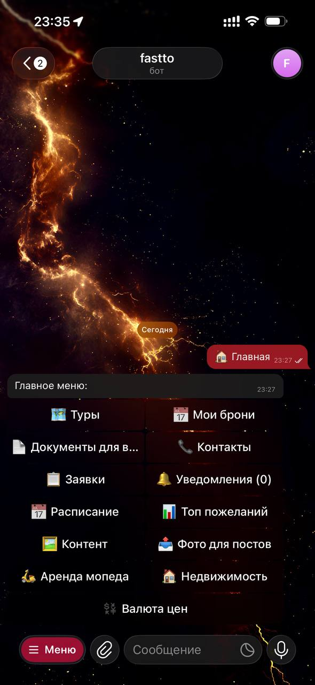
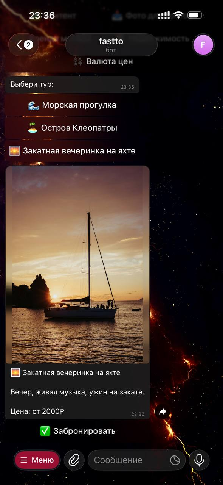
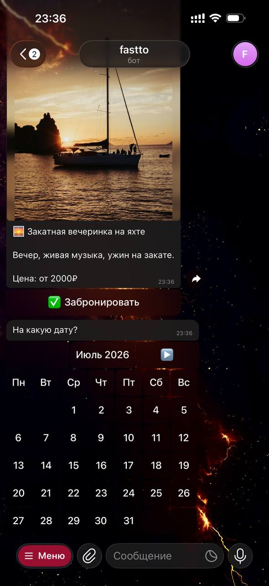
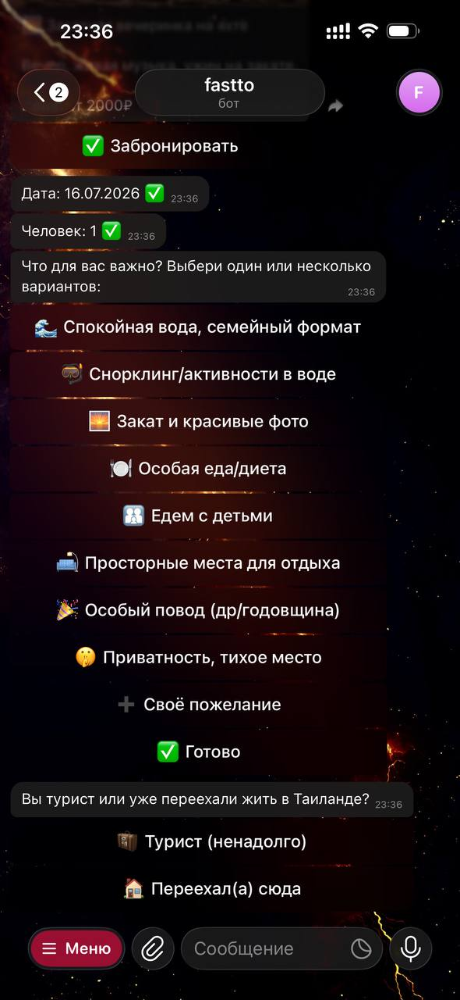
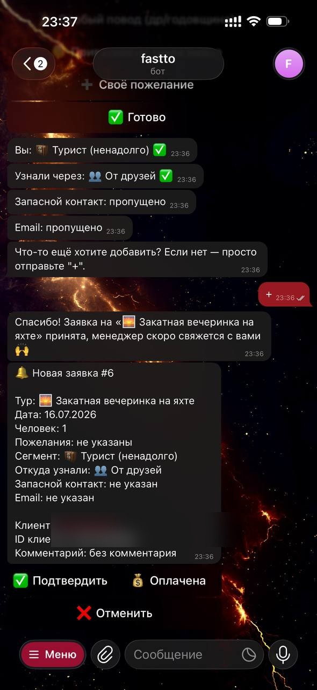

# Turist Bot


Telegram-бот на Python для бронирования морских туров (Турция). Клиент выбирает тур, оставляет заявку в чате, менеджер видит и обрабатывает её тут же в Telegram — без сторонней CRM.

## Скриншоты

| Главное меню | Карточка тура | Выбор даты |
|---|---|---|
|  |  |  |

| Пожелания клиента | Заявка у менеджера |
|---|---|
|  |  |

Путь клиента: каталог → карточка тура с фото и ценой → календарь → количество человек → пожелания → заявка. Менеджер получает уведомление с кнопками «Подтвердить / Оплачена / Отменить» прямо в Telegram.

## Возможности

**Для клиента**
- Каталог туров с фото и описанием
- Бронирование через календарь: дата, кол-во человек, пожелания (теги), сегмент турист/релокант, источник, запасной контакт, комментарий
- Просмотр своих броней и их статуса
- Справка по визовым документам (Таиланд/Вьетнам/Турция)
- Напоминания в Telegram за 3 дня и за 1 день до тура
- Email при подтверждении брони — памятка по визе и страховке

**Для админа**
- Список заявок и уведомления о новых, с кнопками смены статуса (подтвердить/оплачено/отменить) прямо в чате
- Ссылка на оплату через ЮKassa, статус заявки обновляется автоматически
- Синхронизация заявок в Google Таблицу
- Генерация карточек для постов в Instagram (фото + градиент + цена + заголовок) из загруженного фото
- Галерея туров: загрузка своих фото, просмотр и удаление прямо в боте
- Обработка фото под соцсети: квадрат для поста, вертикаль для сторис
- Топ пожеланий клиентов — статистика по тегам
- Расписание туров по календарю
- Поддержка нескольких админов

**Надёжность**
- 48 автотестов (pytest)
- Ежедневный автобэкап базы заявок (локально + облако)
- Watchdog: следит, чтобы бот работал ровно в одном экземпляре, и перезапускает при падении

## Стек

- Python 3, [aiogram 3](https://docs.aiogram.dev/) — асинхронный Telegram-бот
- SQLite (`db.py`) — хранение заявок
- [gspread](https://docs.gspread.org/) — синхронизация с Google Sheets (опционально)
- [YooKassa](https://yookassa.ru/) — приём платежей (опционально)
- Pillow — генерация карточек для Instagram
- pytest — тесты

## Установка

```bash
python3 -m venv venv
source venv/bin/activate
pip install -r requirements.txt
```

## Настройка (.env)

Создай файл `.env` в корне проекта:

```
BOT_TOKEN=токен_от_BotFather
ADMIN_IDS=123456789,987654321
```

Опционально (без них соответствующие функции просто отключаются):

```
GOOGLE_SHEETS_ID=id_таблицы
GOOGLE_CREDENTIALS_PATH=google_credentials.json
YOOKASSA_SHOP_ID=...
YOOKASSA_SECRET_KEY=...
```

Для Google Sheets также нужен файл `google_credentials.json` (сервисный аккаунт Google Cloud) в корне проекта.

## Запуск

```bash
python3 bot.py
```

## Тесты

```bash
pip install -r requirements-dev.txt
pytest
```

## Структура проекта

```
bot.py       — вся логика бота: меню, бронирование, админ-панель, карточки
db.py        — SQLite: заявки и их статусы
payments.py  — интеграция с ЮKassa
sheets.py    — синхронизация с Google Таблицей
mailer.py    — email клиенту при подтверждении брони
scripts/     — автобэкап базы, watchdog, healthcheck
images/      — фото туров
tests/       — тесты pytest
```
